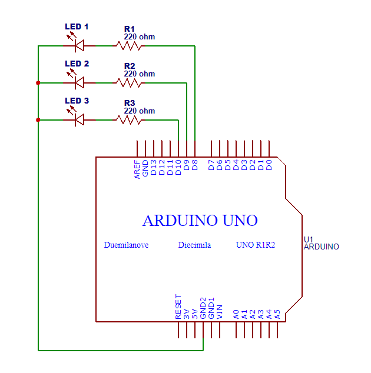

## Ejemplo 01 ProtoThreads Arduino

Ejemplo utilizando la librería **ProtoThreads** con **Arduino**. Se realiza secuencia de luces utilizando 3 diodos leds de forma simultanea.

* Librería ProtoThreads: http://dunkels.com/adam/pt/download.html
* Simulador Arduino Uno: https://www.tinkercad.com

